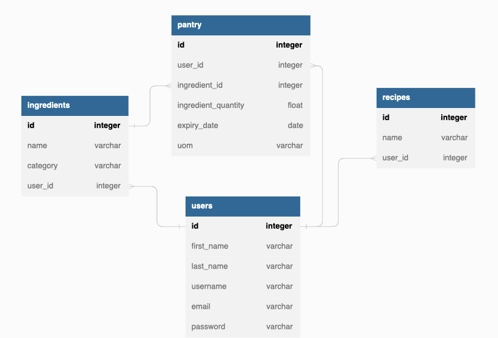

# FoodWorx

A Food Waste Reduction App

Our web app will be designed to achieve the goal of reducing food waste by providing a platform for users to manage their food inventory, track expiration dates, and receive recipe recommendations based on items that are about to expire.

## API Reference

#### Search Recipes by Ingredients

```http
  GET /api.spoonacular.com/recipes/findByIngredients?apiKey=YOUR-API-KEY&ingredients=apples,+flour
```

| Parameter     | Type     | Description                |
| :-----------  | :------- | :------------------------- |
| `api_key`     | `string` | **Required**. Your API key |
| `ingredients` | `string` | A comma-separated list of ingredients that the recipes should contain. |

## Schema

